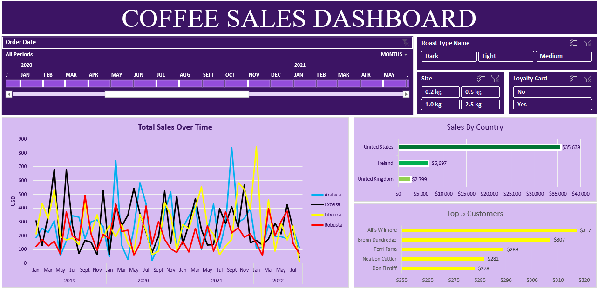

# Coffee Sales Dashboard



## Project Overview

This project is an interactive Coffee Sales Dashboard built in Microsoft Excel to analyze sales performance and generate business insights from coffee sales data. The dashboard transforms raw transactional data into meaningful visualizations using Pivot Tables, Pivot Charts, Slicers, and Timelines.

The project provides a user-friendly interface for exploring sales trends, customer behavior, product performance, and regional sales distribution.

---

## Objectives

* Analyze coffee sales trends over time.
* Compare sales performance across different coffee types.
* Identify top customers based on revenue.
* Evaluate sales performance by country.
* Enable dynamic filtering through interactive controls.
* Present business insights in a professional dashboard format.

---

## Dashboard Features

### Total Sales Over Time

A line chart that tracks sales performance over multiple years for different coffee varieties:

* Arabica
* Excelsa
* Liberica
* Robusta

This chart helps identify trends, seasonal patterns, and peak sales periods.

### Sales by Country

A horizontal bar chart displaying total sales revenue generated from:

* United States
* Ireland
* United Kingdom

This visualization provides a clear comparison of regional performance.

### Top 5 Customers

A ranked bar chart highlighting the highest-value customers based on total purchases.

This feature helps businesses identify loyal and profitable customers.

### Interactive Filters

The dashboard includes the following slicers and filters:

#### Roast Type

* Dark
* Medium
* Light

#### Package Size

* 0.2 kg
* 0.5 kg
* 1.0 kg
* 2.5 kg

#### Loyalty Card Status

* Yes
* No

#### Timeline Filter

* Month and Year selection

These controls allow users to dynamically explore the data and customize the analysis.

---

## Tools and Technologies

| Technology      | Purpose               |
| --------------- | --------------------- |
| Microsoft Excel | Dashboard Development |
| Pivot Tables    | Data Aggregation      |
| Pivot Charts    | Data Visualization    |
| Slicers         | Interactive Filtering |
| Timeline        | Date-Based Analysis   |
| Excel Functions | Data Transformation   |

---

## Dataset Information

The dataset contains coffee sales transaction records including:

* Order Date
* Customer Information
* Country
* Coffee Type
* Roast Type
* Package Size
* Loyalty Card Status
* Sales Amount

---

## Key Insights

The dashboard helps answer important business questions such as:

* Which coffee type generates the highest sales?
* Which country contributes the most revenue?
* Who are the top customers?
* How do sales change over time?
* What impact does roast type or package size have on sales?
* How does customer loyalty affect purchasing behavior?

---

## Skills Demonstrated

* Data Cleaning
* Data Analysis
* Data Visualization
* Dashboard Design
* Business Intelligence Reporting
* Pivot Tables
* Pivot Charts
* Interactive Reporting
* Excel Analytics

---

## Project Structure

```text
Coffee-Sales-Dashboard/
│
├── Coffee Sales Analysis.xlsx
├── README.md
└── screenshots/
    └── dashboard.png
```

---

## Conclusion

This dashboard demonstrates how Excel can be used as a powerful business intelligence tool to convert raw sales data into meaningful insights. Through interactive visualizations and filtering capabilities, users can monitor performance, identify trends, and support data-driven decision-making.
